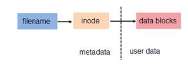

##link

功能：为现有文件创建硬链接  
路径：/usr/bin/link

参数： 无参数  
用法： link file1 file2

##用途
为现有的文件创建额外的链接 (硬链接) 

##调用流程
link函数使file2链接到file1

##代码

      1 #include <stdio.h>
      2 #include <stdlib.h>
      3 #include <sys/types.h>
      4
      5 int main(int argc,char **argv)
      6 {
      7         if( argc == 3)
      8         {
      9                 if(link(argv[1],argv[2]) != 0)
     10                 {
     11                  printf("cannot create link %s to %s",argv[2],argv[1]);
     12                 }
     13         }
     14         else
     15         {
     16                 printf("link file1 file2\n");
     17                 exit(0);
     18         }
     19
     20         return 0;
     21 }
     22
     23

结果：

    [link] ./link test.c test                                                  
    [link] ll                                                                  
    total 20K
    -rwxr-xr-x 1 root root 5.3K Oct  9 11:31 link
    -rw-r--r-- 1 root root  290 Oct  9 11:35 link.c
    -rw-r--r-- 2 root root    6 Oct  9 11:32 test
    -rw-r--r-- 2 root root    6 Oct  9 11:32 test.c

##软链接和硬链接
在linux下，文件被分成两个部分，用户数据(user data) 和 元数据(metadata)  
  

用户数据即文件数据块(data block),数据块是记录文件真实内容的地方。  
元数据则是文件的附件属性，如：文件大小，创建时间等信息  

在linux下，元数据中的inode(索引节点号）才是文件唯一的标识  
在linux下，可以通过stat 或者ls -i来查看inode号  

    [link] ls -ali   
    total 28
    702623 drwxr-xr-x  2 root root 4096 Oct  9 11:35 .
    695323 drwxr-xr-x 10 root root 4096 Oct  9 11:24 ..
    694939 -rwxr-xr-x  1 root root 5361 Oct  9 11:31 link
    695320 -rw-r--r--  1 root root  290 Oct  9 11:35 link.c
    695319 -rw-r--r--  2 root root    6 Oct  9 11:32 test
    695319 -rw-r--r--  2 root root    6 Oct  9 11:32 test.c

可以看到test和test.c的inode号是相同的  

####硬链接
硬链接就是一个inode号对应多个文件名，则称这些文件是为硬链接，其实就是一个文件存在多个别名  
硬链接的特点：  
- 文件有相同的inode和data block
- 只能对已存在的文件创建
- 不能交叉文件系统进行硬链接的创建
- 不能对目录创建(因为对目录创建可能产生目录环)只能对文件创建 
- 删除一个硬链接文件并不影响其他相同inode号的文件  

test和test.c的stat信息

    [link] stat test          
      File: `test'
      Size: 6               Blocks: 8          IO Block: 4096   regular file
    Device: 801h/2049d      Inode: 695319      Links: 2
    Access: (0644/-rw-r--r--)  Uid: (    0/    root)   Gid: (    0/    root)
    Access: 2014-10-09 11:32:26.340981249 +0800
    Modify: 2014-10-09 11:32:28.484981172 +0800
    Change: 2014-10-09 11:35:53.848973759 +0800
     Birth: -
    [link] stat test.c              
      File: `test.c'
      Size: 6               Blocks: 8          IO Block: 4096   regular file
    Device: 801h/2049d      Inode: 695319      Links: 2
    Access: (0644/-rw-r--r--)  Uid: (    0/    root)   Gid: (    0/    root)
    Access: 2014-10-09 11:32:26.340981249 +0800
    Modify: 2014-10-09 11:32:28.484981172 +0800
    Change: 2014-10-09 11:35:53.848973759 +0800
     Birth: -

####软链接
软链接是一个文件用户数据块中存放的内容是另一个文件的路径的指向，那么这个文件就是软链接 

软链接就一个普通的文本文件，有自己的inode号和用户数据块  

软链接的特点：
- 软链接有自己的文件属性和权限
- 可对不存在的文件或者目录创建软链接
- 软链接可对交叉文件系统
- 软链接可对文件或者目录创建
- 创建软链接时，链接计数i_nlink不会增加
- 删除软链接并不影响被指向的文件，如被指向的原文件被删除，那么软链接称为死链接  
  
  

软链接是数据块中的内容指向file

创建test.c的软链接soft.link:  

    [link] ln -s test.c soft.link                                          
    [link] ls -li                                           
    total 20
    694939 -rwxr-xr-x 1 root root 5361 Oct  9 11:31 link
    695320 -rw-r--r-- 1 root root  290 Oct  9 11:35 link.c
    695263 lrwxrwxrwx 1 root root    6 Oct  9 13:24 soft.link -> test.c
    695319 -rw-r--r-- 2 root root    6 Oct  9 11:32 test
    695319 -rw-r--r-- 2 root root    6 Oct  9 11:32 test.c

查看soft.link文件的状态：

    [link] stat soft.link                                 
      File: `soft.link' -> `test.c'
      Size: 6               Blocks: 0          IO Block: 4096   symbolic link
    Device: 801h/2049d      Inode: 695263      Links: 1
    Access: (0777/lrwxrwxrwx)  Uid: (    0/    root)   Gid: (    0/    root)
    Access: 2014-10-09 13:24:10.824739240 +0800
    Modify: 2014-10-09 13:24:09.772739278 +0800
    Change: 2014-10-09 13:24:09.772739278 +0800
     Birth: -

